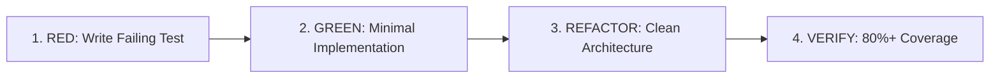

# Test-Driven Development (TDD) Skill Pack

## Overview
TDD is non-negotiable in Everything Antigravity. Write tests before implementation code to lock in expected specifications and contract boundaries.

## The TDD Cycle

### Stage 1: RED (Write Test First)
1. Define test cases covering:
   - Happy path / standard input
   - Edge cases (null, undefined, boundary values, empty arrays)
   - Failure modes & expected exception throwing
2. Run test runner command (`npm test`, `pytest`, `cargo test`, `go test`).
3. **Verify the test FAILS for the expected reason**.

### Stage 2: GREEN (Pass Test)
1. Write the simplest implementation code that satisfies the test.
2. Run test runner again to confirm all tests pass.

### Stage 3: REFACTOR (Improve Code)
1. Clean up variable names, extract duplicated logic, enforce immutability.
2. Re-run tests to ensure zero regressions.

### Stage 4: COVERAGE & VERIFICATION
1. Measure code coverage metrics. Ensure 80%+ coverage on modified modules.
