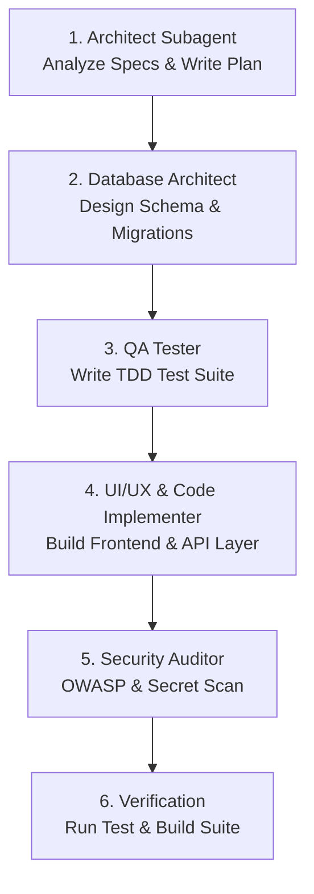

# Workflow Recipe: Build MVP (`orch-build-mvp`)

This orchestrated multi-agent workflow coordinates subagents to take a product requirement from concept to a fully functional, tested MVP.

## Step 1: System Planning
Launch `codebase-architect` subagent (`model: pro`) to analyze requirements and generate `implementation_plan.md`.

## Step 2: Data Model Setup
Launch `database-architect` subagent (`model: pro`) to design tables, relationships, and migration scripts.

## Step 3: TDD Test Harness
Launch `qa-tester` subagent (`model: flash`) to write RED test specs based on the implementation plan.

## Step 4: Full Stack Implementation
Implement components adhering to `modern-web-architecture` and `RULES.md`.

## Step 5: Security Audit
Launch `security-auditor` subagent (`model: flash`) to perform pre-commit vulnerability scanning.

## Step 6: Final Verification
Execute `./scripts/verify-all.sh` to confirm 100% build and test pass rate.
